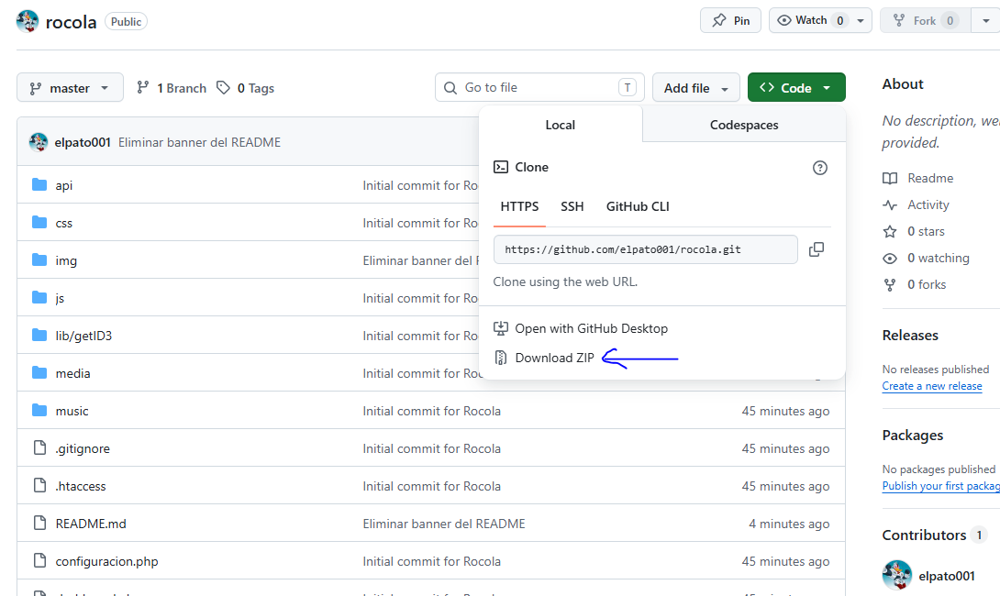
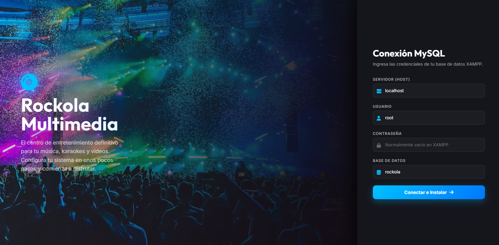
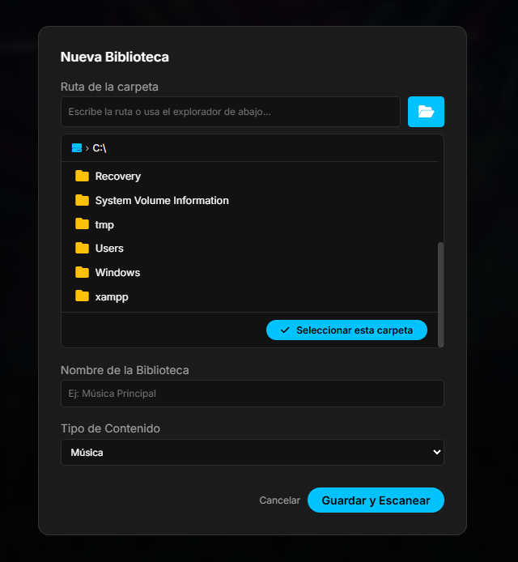
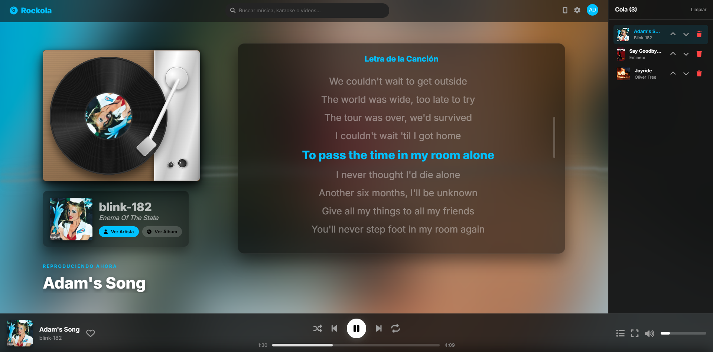
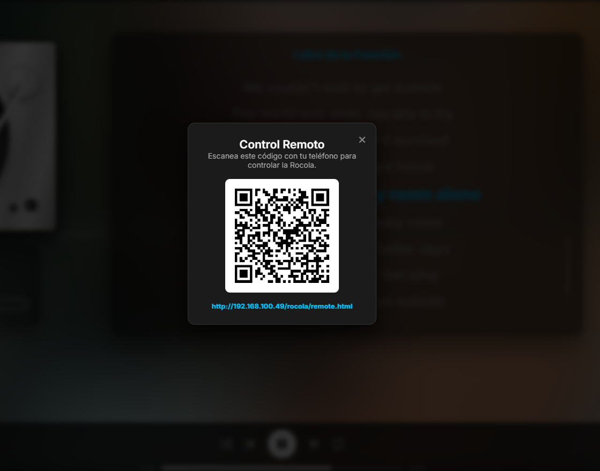
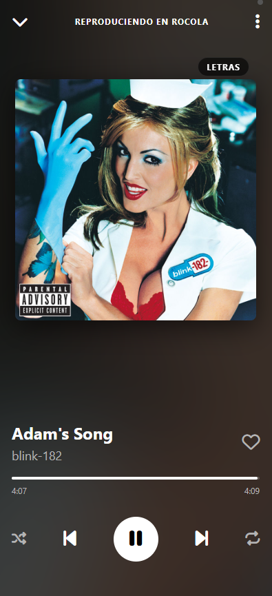
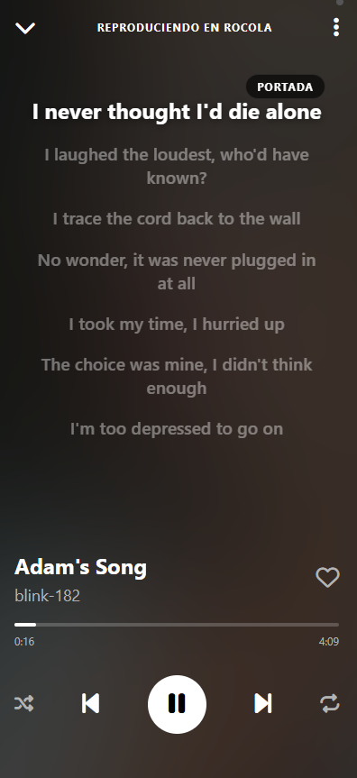

<div align="center">
  <h1>🎵 Rocola Multimedia</h1>
  <p>
    <strong>Un sistema web de rocola (jukebox) modular.</strong>
  </p>
</div>

<p align="center">
  <a href="#características-principales">Características</a> •
  <a href="#requisitos-previos">Instalación</a> •
  <a href="#uso-y-control-remoto">Control Remoto</a> •
  <a href="#tecnologías">Tecnologías</a>
</p>

---

## 📖 Descripción

**Rocola Multimedia** es un sistema web diseñado para gestionar y reproducir tu biblioteca de medios locales (Música, Karaoke y Videos). El proyecto ofrece una experiencia de reproducción continua mediante una arquitectura SPA (Single Page Application) e incluye un panel administrativo y un control remoto web adaptado para dispositivos móviles.

## ✨ Características Principales

*   **🎨 Modo Ambiente Dinámico:** La interfaz extrae el color dominante de la carátula de la pista en reproducción y ajusta la paleta de colores de la aplicación y del visualizador en tiempo real.
*   **📱 Control Remoto PWA (Progressive Web App):** Controla la rocola desde tu teléfono móvil. Incluye controles completos de reproducción (Play, Pause, Seek, Shuffle, Repeat) sincronizados instantáneamente con la pantalla principal.
*   **🎤 Soporte para Karaoke y Letras Sincronizadas:** Disfruta del modo Karaoke con descarga automatizada de letras y visualización sincronizada en tiempo real a medida que avanza la canción.
*   **💿 Animaciones Auténticas:** Experiencia visual mejorada con animaciones de "tocadiscos" (el brazo de la aguja y el disco de vinilo giran y avanzan de manera realista durante la reproducción).
*   **🤖 Metadatos Automatizados:** El sistema escanea los archivos y descarga automáticamente metadatos de las pistas y portadas de álbumes de alta calidad.
*   **⚙️ Asistente de Instalación Inteligente (Wizard):** Configuración automática e intuitiva. Si detecta un fallo en la base de datos, inicia el asistente para guiarte en el proceso de conexión y configuración inicial sin tocar código.
*   **🏗️ Arquitectura Modular (SPA):** Navegación fluida e ininterrumpida de la música mientras navegas por diferentes módulos (Dashboard, Música, Configuración).

## 🚀 Requisitos Previos

Para ejecutar Rocola Multimedia en tu entorno local o servidor, necesitarás:

1.  **Servidor Web:** Apache o Nginx (recomendado entorno [XAMPP](https://www.apachefriends.org/), [WAMP](https://www.wampserver.com/) o similar).
2.  **PHP:** Versión 8.0 o superior.
3.  **Base de Datos:** MySQL o MariaDB.
4.  **Librería de PHP:** Se recomienda tener habilitadas las extensiones `pdo_mysql`, `curl`, y `gd`.

## 🛠️ Instalación y Configuración

1. **Descargar el proyecto:**
   Haz clic en el botón verde **`<> Code`** en la parte superior de esta página y selecciona **Download ZIP**. Luego, extrae el contenido del archivo `.zip` en tu equipo.

   
2. **Ubicación de archivos:**
   Mueve los archivos a la carpeta pública de tu servidor (por ejemplo, `c:\xampp\htdocs\rocola`).
3. **Ejecutar el Asistente:**
   Abre tu navegador web y visita `http://localhost/rocola`. El sistema detectará automáticamente si la base de datos no está configurada y te redirigirá al **Asistente de Configuración**.

   

4. **Agrega tus archivos:**
   Ve al panel de administrador en el sistema y define las rutas de tus bibliotecas de música, videos y karaoke. El escáner interno se encargará del resto.

   

## 🎵 Reproductor y Sincronización de Letras

El sistema cuenta con un reproductor inmersivo diseñado para ofrecer la mejor experiencia visual y auditiva. 



**Gestión de Letras Automatizada:**
No necesitas buscar letras manualmente. El usuario solo debe poner a reproducir una canción y la aplicación se encarga de buscar, descargar y sincronizar las letras en tiempo real. 
* **Uso Offline:** Una vez descargadas, las letras se guardan automáticamente en tu equipo, por lo que estarán disponibles para su uso sin conexión a internet en el futuro.
* **Descarga Masiva:** Si deseas preparar el sistema para usarlo completamente offline, puedes ir al panel de configuración y ejecutar la opción de descargar todas las letras de tu biblioteca de una sola vez.

## 📱 Control Remoto PWA

El sistema incluye un control remoto progresivo (PWA) diseñado para usarse desde tu teléfono móvil sin necesidad de instalar aplicaciones adicionales.

**Conexión Fácil y Rápida:**
Simplemente escanea el código QR que aparece en la aplicación principal para vincular tu dispositivo instantáneamente con el reproductor activo.



**Interfaz Sincronizada en Tiempo Real:**
Una vez conectado, tu teléfono mostrará la carátula de la pista en reproducción. Tienes acceso total para pausar, cambiar de canción, ajustar el volumen y controlar la cola de reproducción con latencia cero.



**Letras en la Palma de tu Mano:**
Además de los controles de reproducción, el control remoto te permite visualizar las letras de la canción perfectamente sincronizadas en tu pantalla, ideal para seguir la música desde cualquier lugar de la habitación.



## 📂 Estructura del Proyecto

```text
rocola/
├── api/             # Endpoints (PHP) para base de datos, metadatos y escáner de medios
├── css/             # Hojas de estilo estructuradas para el tema dinámico
├── js/              # Lógica del frontend (SPA, sincronización, animaciones de vinilo)
├── lib/             # Librerías externas (ej. getID3 para leer metadatos locales)
├── data/            # Configuraciones locales (excluido en git)
├── media/           # Directorios de destino para carátulas y letras (excluido en git)
├── index.php        # Punto de entrada principal (Arquitectura SPA)
├── setup.php        # Asistente de configuración de la base de datos
├── remote.html      # Interfaz PWA del Control Remoto
└── README.md        # Documentación (este archivo)
```

## 💻 Tecnologías

*   **Backend:** PHP (PDO, Endpoints REST)
*   **Frontend:** HTML5, CSS3 (Animaciones, Variables CSS dinámicas, Flexbox/Grid), JavaScript Vanilla
*   **Base de datos:** MySQL / MariaDB
*   **Librerías:** getID3 (Lectura de archivos de audio)

## 🤝 Contribuir

¡Las contribuciones son bienvenidas! Si deseas mejorar este proyecto:
1. Haz un Fork del repositorio
2. Crea una rama para tu función (`git checkout -b feature/NuevaFuncion`)
3. Haz Commit a tus cambios (`git commit -m 'Añadir NuevaFuncion'`)
4. Haz Push a la rama (`git push origin feature/NuevaFuncion`)
5. Abre un Pull Request

---
<div align="center">
  Hecho con ❤️ para amantes de la música y desarrolladores creativos.
</div>
